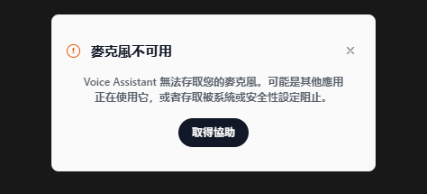
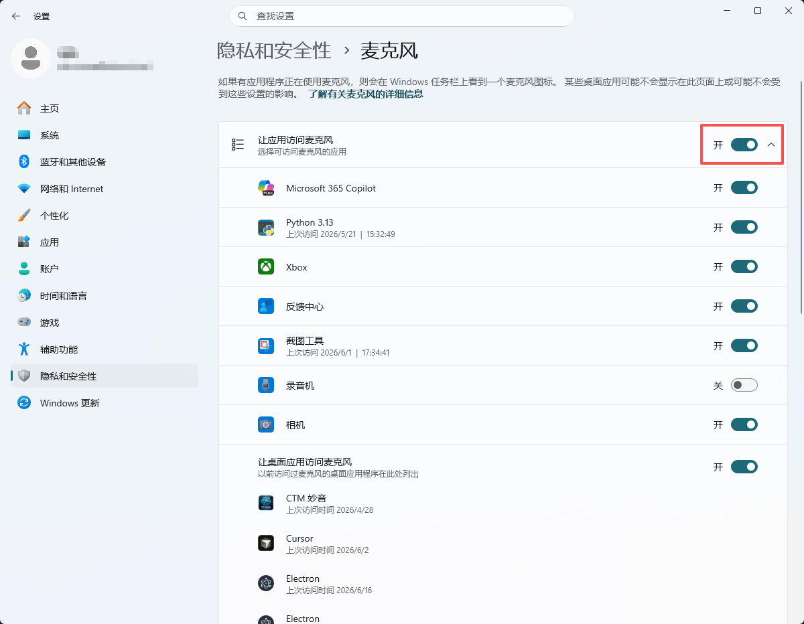

# 如何解决“麦克风不可用”错误？

如果 Voice Assastant 显示 **“麦克风不可用”**，表示应用现在无法访问您的麦克风。

通常由以下原因导致：
- 操作系统阻止了麦克风访问权限
- 安全软件或设备管理策略阻止了访问
- 其他应用正在使用麦克风
- 当前选择的麦克风不可用，或无法正常工作

## 开始之前

请先确认您正在使用最新版 Voice Assastant。一些硬件兼容问题只需要更新应用即可解决。

如果已经是最新版，但仍看到此错误，请按下面的 Windows 排查步骤处理：

***

## Windows 排查

### 检查 Windows 麦克风权限

确认 Windows 允许应用使用您的麦克风。

**Windows 11**
1. 打开 **设置**
2. 进入 **隐私和安全性** → **麦克风**
3. 开启：
- **麦克风访问**
- **允许应用访问你的麦克风**
- **允许桌面应用访问你的麦克风**（滚动到底部可以找到）

**Windows 10**
1. 打开 **设置**
2. 进入 **隐私** → **麦克风**
3. 开启：
- **允许访问此设备上的麦克风**
- **允许应用访问你的麦克风**
- **允许桌面应用访问你的麦克风**

更新设置后，重新打开 Voice Assastant 再试一次。

### 检查杀毒软件、安全软件或 IT 管理工具

即使 Windows 设置看起来正确，一些安全工具仍可能阻止麦克风访问。

这种情况常见于：
- 工作或学校电脑
- 由 IT 管理的设备
- 安装了隐私工具或厂商管理工具的电脑
- 使用终端安全或杀毒软件的系统

例如杀毒软件、企业设备管理工具、隐私控制工具、厂商工具等。

**处理方法**

打开电脑上已安装的安全或隐私软件，查找与以下内容相关的设置：
- 麦克风访问
- 设备权限
- 应用权限
- 隐私保护
- 终端保护

检查 Voice Assastant 是否被阻止。如果可以，请允许 Voice Assastant 访问麦克风，然后完全退出并重新打开应用。

**如果这是公司或学校管理的设备**

您的组织可能通过 IT 策略限制麦克风访问，且您无法自行修改。请联系 IT 管理员，确认 Voice Assastant 是否被阻止访问麦克风。

### 关闭正在使用麦克风的其他应用

如果其他应用已经占用了麦克风，Voice Assastant 可能无法访问它。

请尝试关闭：
- 会议应用
- 录音应用
- 正在使用语音输入的浏览器标签页
- 后台运行的音频工具

然后重新打开 Voice Assastant 再试一次。

### 关闭 Windows 独占模式

Windows 允许某个应用独占控制麦克风，这可能会让 Voice Assastant 无法使用麦克风。

**关闭独占模式**
1. 右键点击任务栏中的扬声器图标
2. 选择 **声音设置**
3. 向下滚动到 **高级** 区域，点击 **更多声音设置**
4. 进入 **录制** 选项卡
5. 双击您的麦克风
6. 选择 **高级** 选项卡
7. 取消勾选：
   - 允许应用程序独占控制该设备
   - 给予独占模式应用程序优先权
8. 点击 **应用**，然后点击 **确定**
9. 重新打开 Voice Assastant 并测试

### 检查 Voice Assastant 和 Windows 中选择的麦克风

有时麦克风本身可用，但选错了设备。

**在 Voice Assastant 中**

1. 打开 **Voice Assastant** → **设置** → **音频** → **麦克风**，选择想使用的麦克风。

2. 对着麦克风说话。如果麦克风正常工作，旁边会看到蓝色指示条移动。

**在 Windows 中**

1. 打开 **设置** → **系统** → **声音**，确认 **输入** 下选择的是正确的麦克风。

2. 如果连接了多个麦克风，Windows 可能正在使用错误的设备。

### 检查麦克风是否在 Windows 中被禁用

麦克风可能已经连接，但在系统层面被禁用。

**检查方法**
- 打开 **设置** → **系统** → **声音**
- 打开 **更多声音设置**
- 进入 **录制** 选项卡

如果看到麦克风，但它处于禁用状态：
- 右键点击它
- 选择 **启用**

如果没有看到麦克风：
- 在设备列表空白处右键点击
- 开启 **显示禁用的设备**
- 如果麦克风出现，右键点击它并选择 **启用**

然后重新打开 Voice Assastant 再试一次。

### 检查硬件连接并重启电脑

如果问题仍然存在，请检查硬件本身。

**处理方法**
- 如果使用 USB 麦克风，请直接插入电脑，不要通过集线器连接
- 拔下并重新连接麦克风
- 如果可以，请尝试其他接口
- 如果可以，请测试另一支麦克风

然后重启电脑。这可以重置音频驱动，并清理可能阻止麦克风访问的后台进程。

***

## 仍需要帮助？

如果问题仍然存在，请发送邮件至 <hello@Voice Assastant.com>，并附上以下信息，方便我们更快定位问题：

- 您的 Voice Assastant 版本和 Windows 版本。
- 这是个人设备，还是公司/学校管理的设备。
- 您使用的麦克风类型（内置、USB、蓝牙等）。
- 是否安装了第三方安全软件或隐私工具。
- 错误消息截图。
