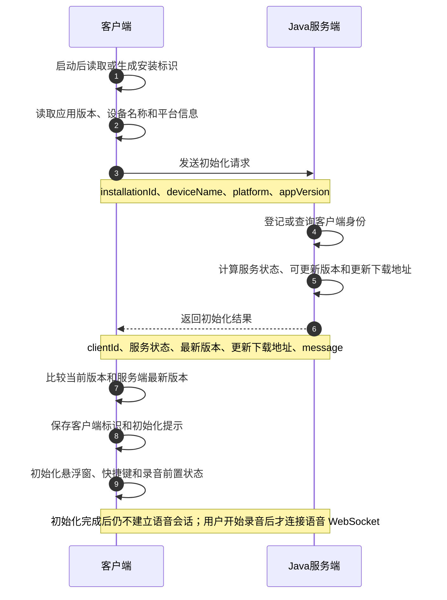

# 客户端初始化详细设计

## 1. 设计目标

客户端安装后首次启动或后续启动时，需要完成一次轻量初始化。初始化用于确认当前客户端身份、服务端可用性、可更新版本和服务端提示信息。

初始化阶段只做启动前置准备，不采集麦克风，不建立语音会话，不发送选中文本，也不上传音频。用户触发录音后，客户端才进入语音 WebSocket 会话。

## 2. 适用范围

本文只描述客户端与 Java 服务端之间的初始化交互。

## 3. 角色职责

| 角色 | 职责 |
|---|---|
| 客户端 | 生成和保存安装标识，读取设备和版本信息，发起初始化请求，保存初始化结果，并根据本地能力和连接结果决定后续功能是否可用 |
| Java 服务端 | 登记客户端身份，返回服务状态、可更新版本、更新下载地址和提示信息 |

## 4. 初始化时序图



## 5. 初始化接口

### 5.1 请求方向

客户端启动后向 Java 服务端发送初始化请求。

### 5.2 请求字段

| 字段 | 类型 | 必填 | 说明 |
|---|---|---|---|
| `installationId` | string | 是 | 客户端本地生成并持久化的安装标识 |
| `deviceName` | string | 是 | 当前设备名称，用于服务端识别和排障 |
| `platform` | string | 是 | 当前平台，现阶段固定为 `windows` |
| `appVersion` | string | 是 | 客户端应用版本，用于服务端返回可更新版本 |
| `locale` | string | 否 | 客户端界面语言，可用于服务端返回本地化提示 |
| `timezone` | string | 否 | 客户端时区，可用于日志和策略判断 |

请求示例：

```json
{
  "installationId": "inst_9f4b2a7c8d",
  "deviceName": "ALEX-WIN11",
  "platform": "windows",
  "appVersion": "1.2.0",
  "locale": "zh-CN",
  "timezone": "Asia/Shanghai"
}
```

### 5.3 响应字段

| 字段 | 类型 | 必填 | 说明 |
|---|---|---|---|
| `clientId` | string | 是 | 服务端登记后的客户端标识 |
| `serviceStatus` | string | 是 | 总体服务状态：`ok`、`degraded`、`unavailable` |
| `serverTime` | string | 是 | 服务端时间，ISO 8601 格式 |
| `latestAppVersion` | string | 否 | 服务端当前最新客户端版本；高于当前版本时提示更新 |
| `updateDownloadUrl` | string | 否 | 客户端更新包下载地址；通常仅在 `latestAppVersion` 高于当前版本时返回 |
| `message` | string | 否 | 服务端返回给客户端展示或记录的提示 |

响应示例：

```json
{
  "clientId": "client_71b8d2f0",
  "serviceStatus": "ok",
  "serverTime": "2026-06-09T10:00:00Z",
  "latestAppVersion": "1.2.0",
  "updateDownloadUrl": "https://download.example.com/voice-assistant/1.2.0/VoiceAssistantSetup.exe",
  "message": "初始化成功"
}
```

### 5.4 客户端初始化默认值（按当前源码）

当前桌面端启动时，主进程在 `bootstrap()` 中创建默认设置、读取或生成安装标识，然后通过 `voice:bootstrap-client` IPC 调用后端客户端初始化。

#### 5.4.1 初始化请求默认值

| 字段 | 当前默认值/来源 | 源码位置 | 说明 |
|---|---|---|---|
| `installationId` | 先读取 `electron-store` 中的 `installationId`；不存在或为空时使用 `crypto.randomUUID()` 生成并写回 | `apps/desktop/src/main/installation/installationId.ts` | 当前实现直接使用 UUID 字符串，不带 `inst_` 前缀 |
| `deviceName` | `os.hostname()` | `apps/desktop/src/main/bootstrap.ts` | 使用 Windows 主机名 |
| `platform` | `"windows"` | `apps/desktop/src/main/ipc/ipcRoutes.ts`、`packages/backend-client/src/types.ts` | 类型固定为 `PlatformName = "windows"` |
| `appVersion` | `app.getVersion()` | `apps/desktop/src/main/bootstrap.ts` | Electron 应用版本 |
| `locale` | 当前不发送 | `packages/backend-client/src/types.ts` | 当前 `ClientBootstrapRequest` 类型未定义该字段 |
| `timezone` | 当前不发送 | `packages/backend-client/src/types.ts` | 当前 `ClientBootstrapRequest` 类型未定义该字段 |

当前源码中的初始化请求等价于：

```json
{
  "installationId": "<electron-store.installationId 或 crypto.randomUUID()>",
  "deviceName": "<os.hostname()>",
  "platform": "windows",
  "appVersion": "<app.getVersion()>"
}
```

#### 5.4.2 初始化响应默认值（当前 mock 后端）

当前主进程使用 `createMockBackendClient()` 创建后端客户端，初始化响应默认值如下：

| 字段 | 默认值 | 源码位置 |
|---|---|---|
| `clientId` | `"mock-anonymous-client"` | `packages/backend-client/src/mockBackendClient.ts` |
| `serviceStatus` | `"ok"` | `packages/backend-client/src/mockBackendClient.ts` |
| `featureFlags.realtimeTranscription` | `true` | `packages/backend-client/src/mockBackendClient.ts` |
| `featureFlags.postprocess` | `true` | `packages/backend-client/src/mockBackendClient.ts` |
| `featureFlags.history` | `true` | `packages/backend-client/src/mockBackendClient.ts` |
| `anonymousQuota.transcriptionSecondsRemaining` | `600` | `packages/backend-client/src/mockBackendClient.ts` |
| `anonymousQuota.postprocessRequestsRemaining` | `100` | `packages/backend-client/src/mockBackendClient.ts` |

当前源码中的初始化响应等价于：

```json
{
  "installationId": "<本地 installationId>",
  "clientId": "mock-anonymous-client",
  "serviceStatus": "ok",
  "featureFlags": {
    "realtimeTranscription": true,
    "postprocess": true,
    "history": true
  },
  "anonymousQuota": {
    "transcriptionSecondsRemaining": 600,
    "postprocessRequestsRemaining": 100
  }
}
```

> 注意：本文上文定义的 `serverTime`、`latestAppVersion`、`updateDownloadUrl`、`message` 属于 Java 服务端接口设计字段；当前源码中的 `ClientBootstrapSnapshot` 尚未包含这些字段。当前 `message` 只出现在 `getServiceStatus()` 返回值中，mock 默认值为空字符串。

#### 5.4.3 启动期本地设置默认值

客户端初始化同时会创建本地默认设置。默认值来自 `createDefaultSettings({ isPackaged: app.isPackaged })`：

| 设置项 | 默认值 | 说明 |
|---|---|---|
| `schemaVersion` | `1` | 设置结构版本 |
| `ui.theme` | `"dark"` | 默认深色主题 |
| `ui.language` | `"zh-CN"` | 默认界面语言 |
| `audio.interactionSounds` | `true` | 默认开启交互音效 |
| `audio.muteOtherAudioDuringRecording` | `true` | 录音时默认降低其他音频 |
| `appBehavior.launchAtLogin` | `true` | 默认开机自启 |
| `developer.enabled` | `false` | 默认关闭开发者配置 |
| `backend.mode` | 打包版 `"production"`；开发版 `"mock"` | 由 `app.isPackaged` 决定 |
| `backend.baseUrl` | `"http://127.0.0.1:8787"` | mock/后端基础地址配置 |
| `ws.servers[0].url` | `"wss://aiapi.ctmcloud.com.mo:8443/Others/websocket-uat2/ws"` | 内置 ASR WebSocket 地址 |
| `ws.selectedIndex` | `0` | 默认使用第一条 ASR 地址 |
| `llm.models[0].baseUrl` | `"http://172.30.21.67:9066"` | AOSO 后处理 HTTP API 地址 |
| `llm.models[0].apiKey` | `"unused"` | 当前 AOSO API 不使用该字段 |
| `llm.models[0].modelName` | `"AOSO API"` | 默认后处理模型名称 |
| `llm.selectedIndex` | `0` | 默认使用第一条 LLM 配置 |
| `shortcuts.toggleRecording` | `"RightAlt"` | 语音直写快捷键 |
| `shortcuts.processSelection` | `"RightAlt+Space"` | 选中文本智能改写快捷键 |
| `shortcuts.translateDictation` | `"RightAlt+RightShift"` | 翻译听写快捷键 |
| `shortcuts.holdToTalk` | `""` | 默认未绑定按住说话 |
| `translation.sourceLanguage` | `"auto"` | 翻译源语言自动检测 |
| `translation.targetLanguage` | `"en-US"` | 默认翻译目标语言 |
| `recording.language` | `"cantonese"` | 默认识别语言 |
| `recording.inputDeviceId` | `""` | 空字符串表示系统默认麦克风 |
| `recording.sampleRate` | `16000` | 固定 16 kHz |
| `recording.maxDurationSeconds` | `60` | 单次录音最长 60 秒 |
| `recording.silenceStopMs` | `900` | 静音停止阈值 |
| `recording.waveformStyle` | `"waveform-sunset"` | 默认波形样式 |
| `ai.postprocessEnabled` | `true` | 默认开启后处理 |
| `ai.defaultMode` | `"clean"` | 默认清理润色 |
| `ai.defaultStyle` | `"natural"` | 默认自然风格 |
| `privacy.saveHistory` | `true` | 默认保存历史 |
| `privacy.historyRetention` | `"forever"` | 默认永久保留历史 |
| `privacy.restoreClipboard` | `true` | 默认恢复剪贴板 |
| `privacy.allowCrashReports` | `false` | 默认不允许崩溃报告 |
| `insertion.strategy` | `"auto"` | 默认自动选择插入策略 |
| `insertion.restoreClipboardDelayMs` | `250` | 插入后恢复剪贴板延迟 |

语音 Java 网关配置不由初始化接口下发。渲染进程读取 `config.json` 失败时，`javaVoiceWsUrl` 默认使用 `JAVA_VOICE_WS_URL`，当前值为 `"ws://172.27.209.114:8095/aoa_api/voice"`。

## 6. 字段设计说明

### 6.1 客户端身份

`installationId` 由客户端本地生成并持久化。卸载后如果保留应用数据，则继续复用；如果应用数据被清除，则重新生成。

`clientId` 由 Java 服务端返回，用于服务端侧登记、风控和日志关联。客户端不应自行生成 `clientId`。

### 6.2 版本检测

客户端收到初始化结果后，只比较当前版本和服务端返回的最新版本。

- 如果 `latestAppVersion` 高于当前 `appVersion`，客户端提示有新版本可更新，并使用 `updateDownloadUrl` 作为下载入口。
- 如果 `latestAppVersion` 为空，或不高于当前 `appVersion`，客户端不提示更新。
- 如果需要提示更新但 `updateDownloadUrl` 为空，客户端只展示版本提示，不自动进入下载流程。

### 6.3 语音网关入口

语音 WebSocket 地址由客户端内置或本地配置提供，初始化接口不返回网络入口配置。

客户端开始录音时，直接使用本地配置中的语音网关地址建立 WebSocket 连接。初始化结果不决定语音模式、音频参数或后处理动作。

## 7. 客户端处理流程

1. 客户端启动后读取或生成本地安装标识。
2. 客户端读取应用版本、设备名称、平台。
3. 客户端发送初始化请求。
4. 客户端收到初始化结果后比较当前版本和服务端最新版本，高于当前版本时提示更新，并使用服务端返回的下载地址进入更新流程。
5. 如果服务不可用，客户端进入初始化错误或受限状态。
6. 如果初始化成功，客户端保存服务端返回的客户端标识和提示信息。
7. 客户端继续准备悬浮窗、快捷键和录音前置状态。
8. 用户触发录音时，客户端按本地配置进入对应语音模式。

## 8. 异常处理

| 场景 | 客户端处理 |
|---|---|
| 初始化请求超时 | 展示服务连接失败，允许用户重试 |
| Java 服务端返回 `unavailable` | 展示服务不可用，允许用户稍后重试 |
| `latestAppVersion` 高于当前版本 | 提示发现新版本，用户可选择通过 `updateDownloadUrl` 下载更新 |
| `message` 不为空 | 按业务需要展示或记录服务端提示 |

## 9. 安全要求

- 初始化接口应使用 HTTPS。
- 服务端应按 `installationId`、`clientId`、版本和请求频率做基础风控。

## 10. 后续扩展

后续如增加登录态、企业策略或多区域部署，可在初始化响应中扩展：

- 用户身份。
