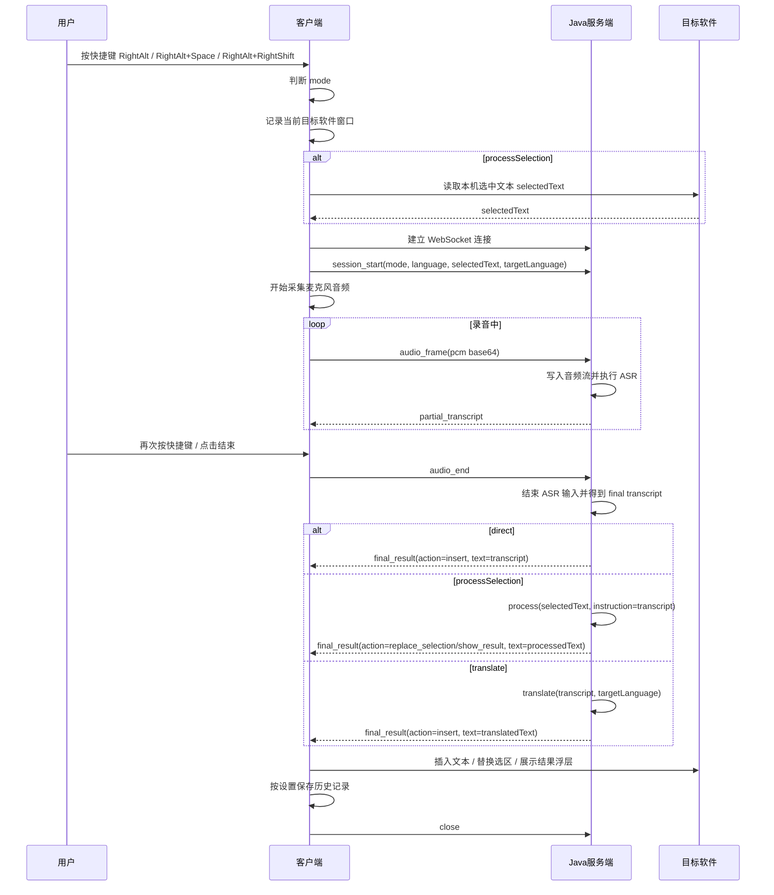
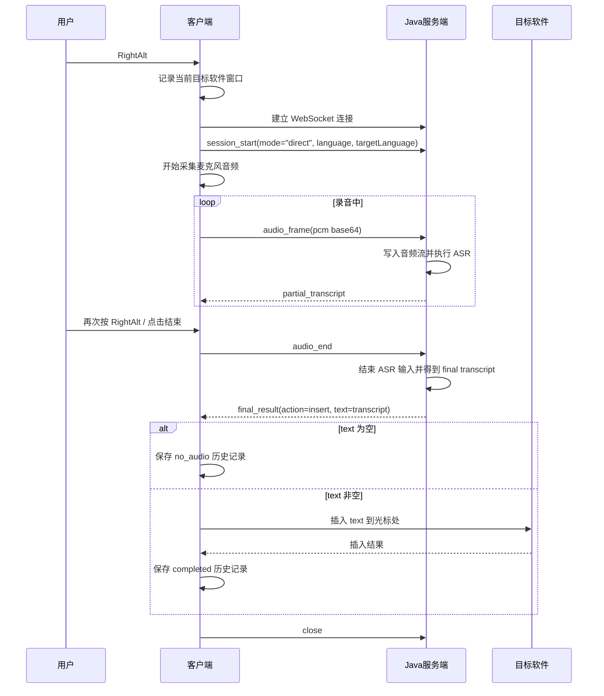
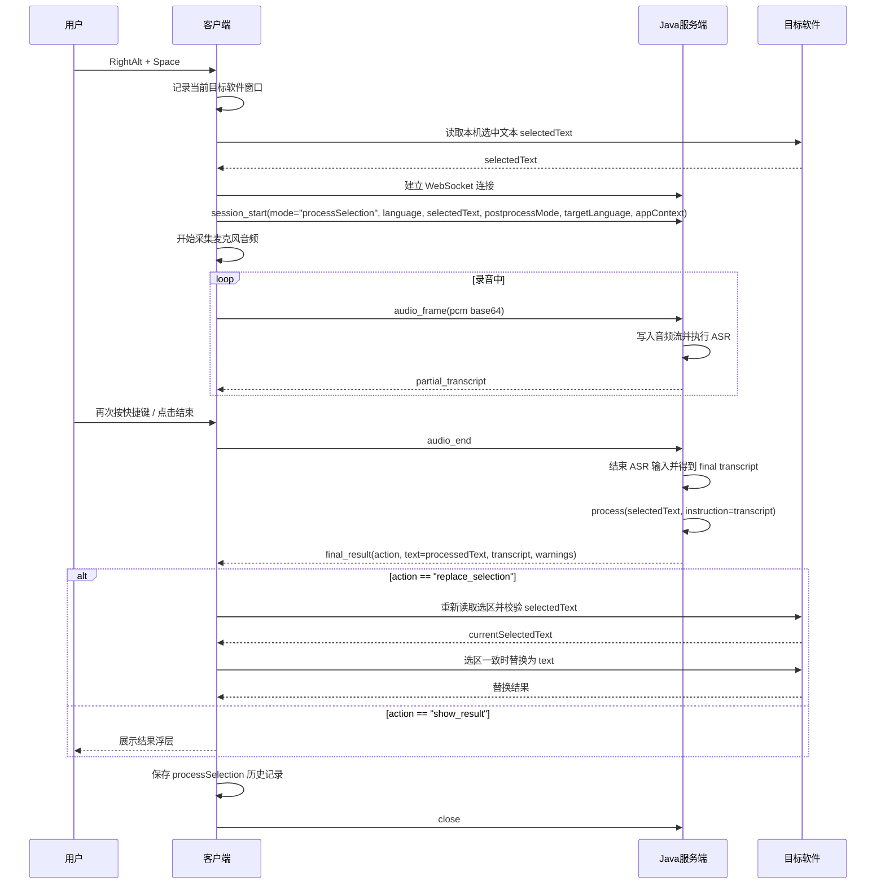
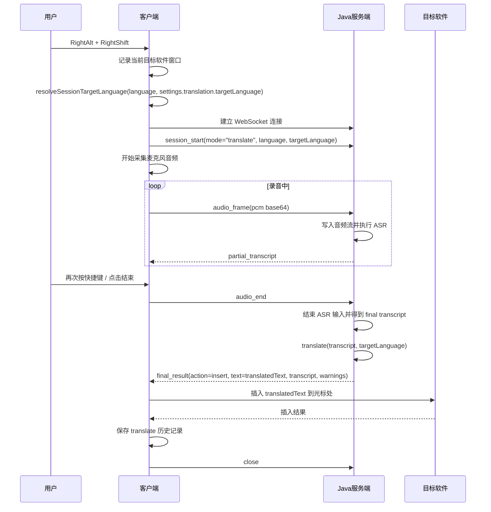

# 核心语音模块详细设计

> 本文面向产品、设计、研发、测试共同理解。内容基于当前实现梳理，说明页面、字段来源、功能、业务规则和关键技术链路。

## 1. 模块介绍

核心语音模块负责从全局快捷键触发录音，采集麦克风声音，完成实时语音识别，生成最终文本，并根据模式插入文本、替换选区或展示结果。若用户开启历史保存，模块还会把本次语音过程写入历史记录。

核心语音模块主要运行在悬浮窗中。用户平时不会看到完整页面，只会在录音、处理、错误、结果等状态下看到悬浮窗提示。

### 主要入口

- 默认悬浮窗窗口：应用启动后创建，用于承载录音状态和操作按钮。
- 全局快捷键：默认支持语音输入、智能改写、翻译三种模式。
- 设置页：提供麦克风、快捷键、服务配置、波形效果等配置。
- 历史页：用于查看语音模块保存下来的记录。

### 前后端调用分层

核心语音流程按前端交互、本地后端协调、远端语音服务和本地数据保存分层。

| 层级 | 责任 | 主要数据 |
|---|---|---|
| 前端交互层 | 展示悬浮窗状态，接收用户确认、取消、复制等操作 | 当前模式、录音状态、音量、识别文本、最终文本、错误提示 |
| 本地后端层 | 管理全局快捷键、窗口显示、设备权限、目标应用交互和历史保存 | 快捷键配置、麦克风设备、目标窗口、选中文本、历史策略 |
| 语音服务层 | 接收音频并返回识别文本、最终文本或动作建议 | 音频片段、安装标识、会话信息 |
| 文本后处理层 | 对识别文本做润色、改写、翻译等处理 | 识别文本、选中文本、模式、输出风格、词库信息 |
| 本地数据层 | 保存用户设置、语音历史和音频文件 | 本地设置、本地历史索引、本地音频文件 |

## 2. 技术实现说明

### 2.1 初始化链路

应用启动后，客户端先准备基础能力：加载本地设置、读取设备和运行配置、建立悬浮窗与快捷键监听，并根据配置选择 Java 语音服务。

悬浮窗准备完成后，系统会进入空闲状态，等待用户按下语音快捷键。录音过程中，客户端持续维护录音状态、音量波形、剩余时长和错误提示，并把状态同步给本地托盘和悬浮窗。

如果初始化阶段读取配置、加载录音能力或连接语音服务配置失败，悬浮窗会进入错误状态，用户需要检查设置或重试。

### 2.2 核心数据来源

| 数据 | 来源 | 读取方法 / 字段 | 用途 |
|---|---|---|---|
| 安装标识 | `electron-store` | `installationId`，由 `getOrCreateInstallationId()` 读写 | ASR、后处理、客户端启动请求携带 |
| 用户设置 | `electron-store` | `settings`，由 `configStore.get()` 读取 | 麦克风、语言、快捷键、后处理、插入、历史保存等 |
| 运行配置 | 本地配置文件 | `loadRendererAppConfig()` / `readAppConfig()` | Java voice gateway URL 等运行时配置 |
| 快捷键配置 | `settings.shortcuts` | `toggleRecording/processSelection/translateDictation` | 主进程注册全局快捷键 |
| 麦克风设备 | `settings.recording.inputDeviceId` 和浏览器 `navigator.mediaDevices` | `getUserMedia()` | 录音采集 |
| 语音识别服务配置 | `settings.ws.servers[selectedIndex]` 或 Java voice URL | `selectVoiceService()` | 决定 ASR 网络通道 |
| 后处理配置 | `settings.llm.models[selectedIndex]`、`settings.ai.*`、`settings.translation.targetLanguage` | `postprocess()` / Java 网关最终结果 | 生成最终文本和动作 |
| 目标窗口 | native helper 当前前台窗口句柄 | `nativeBridge.getForegroundWindowHandle()` | 插入或复制选区前恢复目标窗口焦点 |
| 选中文本 | 目标应用当前选区 | `window.voiceAI.getSelectedText()` -> `selectionService.getSelectedText()` | 智能改写上下文和替换安全校验 |
| 音频帧 | 浏览器麦克风 | `AudioWorkletNode` -> `AudioFrame` | 实时转写、音量波形、历史音频 |
| 历史保存开关 | `settings.privacy.saveHistory` | `App.tsx` 初始化传入 `saveHistory` | 决定是否调用 `createHistoryRecord()` |

## 3. 页面内容与字段说明

### 3.1 悬浮窗内容

| 内容 | 用户看到什么 | 数据来源 | 是否可操作 | 规则 |
|---|---|---|---|---|
| 空闲状态 | 通常不显示悬浮窗 | 当前语音状态 | 否 | 应用保持后台待命 |
| 录音状态 | 音量波形、取消按钮、确认按钮、模式提示 | 麦克风音量、当前模式、当前语音状态 | 是 | 用户可取消或确认结束录音 |
| 取消状态 | 取消提示和撤销按钮 | 当前会话状态 | 是 | 仅刚取消录音后可撤销 |
| 处理中状态 | “思考中”或类似提示 | 语音识别和后处理阶段 | 可取消 | 避免用户重复启动新录音 |
| 结果状态 | 智能改写或问答结果面板 | 后处理最终结果 | 可关闭、可复制 | 主要用于不直接插入的结果 |
| 错误状态 | 麦克风、网络、处理、插入、快捷键冲突等错误 | 语音流程异常 | 部分可重试 | 网络类错误可提供重试 |
| 快捷键帮助 | 三种模式的快捷键说明 | 本地快捷键设置 | 否 | 仅空闲状态下展示 |
| 录音时限提示 | 剩余时间提醒 | 当前录音开始时间和最大时长 | 可关闭提示 | 默认接近上限时显示 |

### 3.2 配置字段

| 配置项 | 用户含义 | 数据来源 | 默认值 | 可编辑位置 | 业务规则 |
|---|---|---|---|---|---|
| 安装标识 | 区分当前设备和客户端 | 本地设置 | 首次启动生成 | 不提供编辑 | 语音识别和后处理请求会携带 |
| 麦克风设备 | 录音使用的输入设备 | 本地设置和系统设备列表 | 系统默认设备 | 设置页音频区域 | 指定设备不可用时尝试回退系统默认设备 |
| 采样率 | 音频采集和识别的采样率 | 固定配置 | 16k | 当前不开放编辑 | 历史音频、识别服务、重试逻辑都按 16k 处理 |
| 单次最大录音时长 | 一次会话允许录多久 | 本地设置 | 当前默认 60 秒 | 当前设置页未展示 | 到达上限自动结束录音 |
| 静音停止时间 | 预留的静音检测配置 | 本地设置 | 900 毫秒 | 当前设置页未展示 | 当前实现未发现实际使用，标记为当前实现未确认 |
| 波形样式 | 悬浮窗音量波形视觉风格 | 本地设置 | 暖色波形 | 设置页音频区域 | 设置变化后悬浮窗使用新样式 |
| 交互声音 | 开始、完成、错误时是否播放提示音 | 本地设置 | 开启 | 设置页音频区域 | 关闭后不播放提示音 |
| 历史保存 | 是否保存语音历史 | 本地设置 | 开启 | 历史页保存策略 | 关闭后语音流程不写历史 |
| 快捷键 | 触发三种语音模式 | 安装初始后本地设置 | 右 Alt 及组合键 | 设置页快捷键区域 | 冲突时悬浮窗提示快捷键错误 |

### 3.3 语音记录字段

核心语音模块结束后会向历史记录模块提交以下信息：

| 字段 | 含义 | 来源 | 规则 |
|---|---|---|---|
| 开始时间 | 本次语音会话何时开始 | 用户开始录音时 | 用于历史排序和分组 |
| 持续时间 | 本次语音会话持续多久 | 开始和结束时间差 | 不小于 0 |
| 模式 | 语音输入、智能改写或翻译 | 用户触发的快捷键 | 影响历史筛选和重试 |
| 状态 | 完成、取消、未识别到声音等 | 会话最终结果 | 文本为空时通常不是完成状态 |
| 识别文本 | 语音识别出的原文 | 识别服务 | 可为空 |
| 最终文本 | 准备插入、替换或展示的文本 | 识别文本或后处理结果 | 可为空 |
| 选中文本 | 智能改写时原始选区内容 | 当前前台应用选区 | 没有选区时不保存 |
| 音频 | 本次录音的声音数据 | 麦克风采集结果 | 有音频时保存，供下载和重试 |

### 3.4 语音会话字段

语音控制器内部的活动会话使用 `ActiveSession`：

| 内部字段 | 类型 | 来源 | 用途 |
|---|---|---|---|
| `mode` | `RecordingMode` | 快捷键模式 | 决定直写、翻译或智能改写 |
| `selectedText` | `string` | `processSelection` 启动时调用 `getSelectedText()` | 后处理上下文、替换选区安全校验、历史字段 |
| `startedAt` | ISO 时间字符串 | `getNow().toISOString()` | 历史记录 `startedAt` |
| `startedAtMs` | `number` | `getNow().getTime()` | 最大录音时长、剩余时间 |
| `audioFrames` | `Int16Array[]` | 录音器持续推送的 PCM16 帧 | 历史音频合并 |
| `pendingTranscriptionFrames` | `AudioFrame[]` | ASR 未就绪前缓存的早期音频 | ASR 启动后补发，最多 30 帧 |
| `transcriptionReady` | `boolean` | ASR start 成功后置 true | 决定音频直接发 ASR 还是先缓存 |
| `transcriptionUnavailable` | `boolean` | ASR start/send 失败时置 true | 停止录音时阻止继续处理，并显示网络错误 |

音频帧 `AudioFrame` 字段：

| 字段 | 类型 | 来源 | 说明 |
|---|---|---|---|
| `pcm` | `Int16Array` | Float32 音频样本转换 | 16-bit PCM |
| `sampleRate` | `16000` | 固定采样率 | IPC 和历史都只接受 16000 |
| `timestampMs` | `number` | worklet 音频时间戳 | ASR 帧时间 |
| `rms` | `number` | Float32 样本均方根 | 悬浮窗音量和波形 |

### 3.5 状态字段映射

`RecordingSnapshot` 是悬浮窗 UI 和主进程托盘显示的核心状态：

| 字段 | 类型 | 来源 | 用途 |
|---|---|---|---|
| `state` | `RecordingState` | `recordingStateMachine` | 控制悬浮窗内容、托盘 tooltip、是否显示/隐藏窗口 |
| `mode` | `RecordingMode?` | start 事件写入 | 显示模式提示，控制再次快捷键行为 |
| `reason` | `VoiceErrorReason?` | fail 事件写入 | 显示麦克风、转写、后处理、插入、快捷键错误 |

主进程收到 `voice:report-recording-state` 后会更新：

- `lastRecordingState`：用于快捷键再次触发时判断当前状态。
- `lastRecordingReason`：用于错误态重放或保持悬浮窗可见。
- 托盘 tooltip。
- 悬浮窗 layout 和显示/隐藏。
- Escape 取消注册状态。

## 4. 功能点描述

### 4.1 初始化

悬浮窗启动后，`App.tsx` 初始化语音控制器。失败时写入 `initError`，悬浮窗展示错误，不进入录音流程。

初始化读取的数据：

| 数据 | 失败影响 |
|---|---|
| 客户端启动信息和 `installationId` | 初始化失败 |
| 本地设置 | 初始化失败 |
| Java voice gateway 配置 | 初始化失败 |
| 录音 worklet URL | 控制器创建失败 |

### 4.2 快捷键触发

默认快捷键规则：

- 右 Alt：语音输入。
- 右 Alt + 空格：智能改写。
- 右 Alt + 右 Shift：翻译。

如果当前状态是 `processing` 或 `inserting`，`App.tsx` 不开启新会话，只显示 busy 提示，防止流程重叠。

### 4.3 录音启动

当悬浮窗处于空闲、错误或成功状态时，用户按下模式快捷键会启动一段新录音会话。

启动步骤：

1. 智能改写模式会先读取目标应用的当前选区，作为后续改写上下文；语音输入和翻译模式不读取选区。
2. 系统创建本次会话，记录模式、选中文本、开始时间和音频缓存。
3. 系统按当前麦克风、采样率和最大录音时长配置打开录音。
4. 系统建立语音识别会话，准备接收后续音频帧。
5. 悬浮窗进入录音中状态，显示音量、取消、确认和模式提示。
6. 系统设置最大录音时长，到达上限后自动结束录音。

如果录音器启动失败，悬浮窗进入错误状态，错误原因标记为麦克风异常。若语音识别启动失败，悬浮窗进入语音识别错误，并提示用户检查网络或服务状态。

### 4.4 录音采集

录音采集由浏览器能力完成：

1. 浏览器请求麦克风权限并打开音频流。
2. 音频约束为单声道，并关闭回声消除、降噪和自动增益。
3. 系统使用 16000 采样率创建音频处理上下文。
4. 浏览器加载录音处理脚本，在独立音频线程中处理输入。
5. 音频线程输出浮点音频帧。
6. 系统把浮点音频转换为 PCM16，并计算音量强度。
7. 系统把短帧合并为约 100ms 一帧，供语音识别和历史保存使用。

如果指定麦克风不可用，并且系统判断为设备约束不满足或设备不存在，会用默认麦克风再试一次。

每条音频帧有两个用途：

- 推给语音识别服务，用于实时转写。
- 暂存到当前会话，用于会话结束后的历史音频保存。

如果语音识别服务尚未就绪，系统会先缓存前 30 帧音频；服务就绪后按顺序补发。超过 30 帧的早期音频不再缓存，避免内存无限增长。

### 4.5 语音识别

Java 语音网关链路：

1. 客户端与 Java 语音网关建立 WebSocket 连接。
2. 连接建立后，客户端发送会话开始消息，内容包含会话标识、模式、录音语言、采样率、音频格式、选中文本、后处理模式、目标语言和当前应用上下文。
3. 录音过程中，客户端持续发送 base64 编码的 PCM16 音频帧。
4. 用户结束录音时，客户端发送录音结束消息。
5. 服务端返回中间识别文本时，客户端更新悬浮窗字幕。
6. 服务端返回最终结果时，客户端记录最终识别文本、处理动作和最终输出文本，供后续插入、替换或展示使用。

### 4.6 停止录音

用户再次按当前模式快捷键、点击确认按钮，或录音到达最大时长后，系统会结束当前会话。

停止步骤：

1. 清除最大录音时长定时器。
2. 悬浮窗从录音中进入处理中状态。
3. 系统停止麦克风，并把剩余不足一帧的音频补齐发送。
4. 如果语音识别会话仍处于不可用状态，本次停止会进入识别错误。
5. 系统等待语音识别服务返回最终文本。
6. 悬浮窗进入插入中状态。
7. 系统按当前模式执行后处理、插入、替换或结果展示。
8. 流程成功后，悬浮窗显示短暂成功状态。
9. 系统按隐私设置组装历史记录入参。
10. 系统清空当前会话和临时识别文本。

如果最终识别文本为空，系统不执行插入或后处理，但仍可以保存无音频文本的历史记录。

### 4.7 三种模式

| 模式 | 技术值 | 处理方式 | 最终动作 |
|---|---|---|---|
| 语音输入 | `direct` | 使用 ASR final 文本 | 直接调用 `insertText(rawText)` |
| 智能改写 | `processSelection` | ASR 文本作为指令，`selectedText` 作为上下文 | 按服务动作替换选区、插入或展示结果 |
| 翻译 | `translate` | 后处理 mode 固定为 `translate` | 按后处理结果插入 |

目标语言规则：

- 当前录音语言是中文类：翻译目标默认为 `en-US`。
- 当前录音语言是英文类：翻译目标默认为 `zh-CN`。
- 其他语言：使用设置里的 `settings.translation.targetLanguage`。

后处理语言规则：

- `mandarin` / `zh-CN` 映射为 `zh-CN`。
- `english` / `en-US` 映射为 `en-US`。
- 其他录音语言映射为 `auto`。

三种业务 API 的入口实际是同一个触发通道：主进程通过 `voice:toggle-recording` 下发 `{ mode }`，渲染进程调用 `controller.handleToggle(mode)`。`mode` 决定后续入参、出参和处理逻辑。

| 业务 API | 入口入参 | 过程入参 | 出参 / 结果 | 处理逻辑 |
|---|---|---|---|---|
| 语音输入 `direct` | `ToggleRecordingPayload { mode: "direct" }` | `TranscriptionStartInput { installationId, language, sampleRate: 16000, mode: "direct", targetLanguage, postprocessMode, appContext }`；音频帧 `AudioFrame { pcm, sampleRate: 16000, timestampMs, rms }` | ASR `finalText` 作为 `rawText`；`insertText(rawText)` 返回 `InsertResult { ok, strategy, fallbackText?, errorCode?, message? }`；历史保存返回 `HistoryRecord` | `startSession("direct")` 不读取选区；启动录音和 ASR；停止后 `applyFinalText()` 如果 `rawText.trim()` 为空则跳过插入并可写 `no_audio` 历史；非空则进入 `inserting`，调用 `textTarget.insertText(rawText)` -> `window.voiceAI.insertText()` -> `voice:insert-text` -> `insertService.insertText()`。Java 链路若 `finalResultBehavior="respect_service_action"`，仍会先取服务端 `PostprocessResult`，再按 `action` 插入。 |
| 智能改写 `processSelection` | `ToggleRecordingPayload { mode: "processSelection" }` | 启动前读取 `selectedText = getSelectedText()`；`TranscriptionStartInput` 增加 `selectedText`；后处理 `PostprocessRequest { installationId, rawText, selectedText, appContext, mode: settings.ai.defaultMode, language, style, targetLanguage, dictionaryTerms }` | 后处理返回 `PostprocessResult { action, finalText, confidence, usedDictionaryTermIds, warnings }`；本机动作可能返回 `InsertResult`；历史保存返回 `HistoryRecord` | `startSession("processSelection")` 先调用 `window.voiceAI.getSelectedText()` -> `voice:get-selected-text` -> `selectionService.getSelectedText()`；停止后生成 `rawText`。Java 链路尊重服务端 `action`：`replace_selection` 调 `replaceSelectedText(finalText, selectedText)`，插入前重新读取选区并校验一致；`insert` 调 `insertText(finalText)`；`show_result` 调 `onPostprocessResult()` 展示结果。 |
| 翻译 `translate` | `ToggleRecordingPayload { mode: "translate" }` | `TranscriptionStartInput { installationId, language, sampleRate: 16000, mode: "translate", targetLanguage, postprocessMode: "translate", appContext }`；后处理 `PostprocessRequest { rawText, mode: "translate", targetLanguage, language, style, dictionaryTerms }` | 后处理返回 `PostprocessResult`；通常调用 `insertText(finalText)` 返回 `InsertResult`；历史保存返回 `HistoryRecord` | `startSession("translate")` 不读取选区；停止后 `resolveSessionPostprocessMode()` 固定返回 `translate`；`resolveSessionTargetLanguage()` 根据录音语言自动选择中英互译目标，其他语言使用设置值；`applyPostProcessResult()` 按后处理 `action` 执行，通常 `insert` 到目标光标处。 |

三种模式交互 JSON 如下。示例中的 `session_start` / `audio_frame` / `audio_end` / `final_result` 是 Java 语音网关 WebSocket 协议；普通主进程 ASR IPC 的 `startTranscription` 当前只校验并转发 `installationId`、`language`、`sampleRate`。

#### 4.7.1 语音输入 `direct`

快捷键入口：

```json
{
  "mode": "direct"
}
```

Java WebSocket 会话开始：

```json
{
  "type": "session_start",
  "sessionId": "voice-20260605-001",
  "mode": "direct",
  "language": "mandarin",
  "sampleRate": 16000,
  "audioFormat": "pcm16",
  "selectedText": "",
  "postprocessMode": "clean",
  "targetLanguage": "en-US",
  "appContext": {
    "platform": "windows",
    "appName": "Unknown",
    "windowTitle": ""
  }
}
```

录音帧：

```json
{
  "type": "audio_frame",
  "sessionId": "voice-20260605-001",
  "seq": 1,
  "pcm": "AAECAwQFBgcICQoLDA0ODxAREhMUFRYXGBkaGxwdHh8="
}
```

结束录音：

```json
{
  "type": "audio_end",
  "sessionId": "voice-20260605-001"
}
```

服务端最终结果：

```json
{
  "type": "final_result",
  "sessionId": "voice-20260605-001",
  "mode": "direct",
  "transcript": "今天下午三点开会",
  "action": "insert",
  "text": "今天下午三点开会",
  "warnings": []
}
```

本机插入 IPC：

```json
{
  "text": "今天下午三点开会"
}
```

插入结果：

```json
{
  "ok": true,
  "strategy": "auto"
}
```

历史保存入参：

```json
{
  "startedAt": "2026-06-05T09:30:00.000Z",
  "durationMs": 3200,
  "mode": "direct",
  "status": "completed",
  "transcript": "今天下午三点开会",
  "finalText": "今天下午三点开会",
  "audio": {
    "pcm": "[Int16Array]",
    "sampleRate": 16000
  }
}
```

#### 4.7.2 智能改写 `processSelection`

快捷键入口：

```json
{
  "mode": "processSelection"
}
```

读取选区结果：

```json
{
  "selectedText": "这是一段需要被润色的原始文本。"
}
```

Java WebSocket 会话开始：

```json
{
  "type": "session_start",
  "sessionId": "voice-20260605-002",
  "mode": "processSelection",
  "language": "mandarin",
  "sampleRate": 16000,
  "audioFormat": "pcm16",
  "selectedText": "这是一段需要被润色的原始文本。",
  "postprocessMode": "clean",
  "targetLanguage": "en-US",
  "appContext": {
    "platform": "windows",
    "appName": "Word",
    "windowTitle": "Document"
  }
}
```

录音帧：

```json
{
  "type": "audio_frame",
  "sessionId": "voice-20260605-002",
  "seq": 1,
  "pcm": "AAECAwQFBgcICQoLDA0ODxAREhMUFRYXGBkaGxwdHh8="
}
```

结束录音：

```json
{
  "type": "audio_end",
  "sessionId": "voice-20260605-002"
}
```

服务端最终结果：

```json
{
  "type": "final_result",
  "sessionId": "voice-20260605-002",
  "mode": "processSelection",
  "transcript": "帮我润色得更正式一点",
  "action": "replace_selection",
  "text": "这是一段经过正式润色后的文本。",
  "warnings": []
}
```

本机替换选区 IPC：

```json
{
  "text": "这是一段经过正式润色后的文本。",
  "expectedSelectedText": "这是一段需要被润色的原始文本。"
}
```

替换结果：

```json
{
  "ok": true,
  "strategy": "auto"
}
```

若服务端返回 `show_result`，不调用替换 IPC，渲染进程展示结果浮层：

```json
{
  "mode": "processSelection",
  "rawText": "帮我润色得更正式一点",
  "selectedText": "这是一段需要被润色的原始文本。",
  "result": {
    "action": "show_result",
    "finalText": "这是一段经过正式润色后的文本。",
    "confidence": 0.85,
    "usedDictionaryTermIds": [],
    "warnings": []
  }
}
```

历史保存入参：

```json
{
  "startedAt": "2026-06-05T09:31:00.000Z",
  "durationMs": 5200,
  "mode": "processSelection",
  "status": "completed",
  "transcript": "帮我润色得更正式一点",
  "finalText": "这是一段经过正式润色后的文本。",
  "selectedText": "这是一段需要被润色的原始文本。",
  "audio": {
    "pcm": "[Int16Array]",
    "sampleRate": 16000
  }
}
```

#### 4.7.3 翻译 `translate`

快捷键入口：

```json
{
  "mode": "translate"
}
```

Java WebSocket 会话开始：

```json
{
  "type": "session_start",
  "sessionId": "voice-20260605-003",
  "mode": "translate",
  "language": "mandarin",
  "sampleRate": 16000,
  "audioFormat": "pcm16",
  "selectedText": "",
  "postprocessMode": "translate",
  "targetLanguage": "en-US",
  "appContext": {
    "platform": "windows",
    "appName": "Unknown",
    "windowTitle": ""
  }
}
```

录音帧：

```json
{
  "type": "audio_frame",
  "sessionId": "voice-20260605-003",
  "seq": 1,
  "pcm": "AAECAwQFBgcICQoLDA0ODxAREhMUFRYXGBkaGxwdHh8="
}
```

结束录音：

```json
{
  "type": "audio_end",
  "sessionId": "voice-20260605-003"
}
```

服务端最终结果：

```json
{
  "type": "final_result",
  "sessionId": "voice-20260605-003",
  "mode": "translate",
  "transcript": "请明天下午三点参加会议",
  "action": "insert",
  "text": "Please attend the meeting at 3 PM tomorrow.",
  "warnings": []
}
```

本机插入 IPC：

```json
{
  "text": "Please attend the meeting at 3 PM tomorrow."
}
```

插入结果：

```json
{
  "ok": true,
  "strategy": "auto"
}
```

历史保存入参：

```json
{
  "startedAt": "2026-06-05T09:32:00.000Z",
  "durationMs": 4100,
  "mode": "translate",
  "status": "completed",
  "transcript": "请明天下午三点参加会议",
  "finalText": "Please attend the meeting at 3 PM tomorrow.",
  "audio": {
    "pcm": "[Int16Array]",
    "sampleRate": 16000
  }
}
```

### 4.8 后处理

`createPostProcessInput()` 传入：

- `installationId`
- `rawText`
- `selectedText`
- `appContext`
- `mode`
- `language`
- `style`
- `targetLanguage`
- `dictionaryTerms`

当前 `getActiveWindow()` 在主进程中返回占位值：

```json
{
  "platform": "windows",
  "appName": "Unknown",
  "windowTitle": ""
}
```

Java 链路后处理结果来自同一条 WebSocket 的 `final_result`。客户端把服务端返回的动作、最终文本和告警转换为统一后处理结果，再交给后续插入、替换或展示流程。

### 4.9 文本插入和替换

插入链路：

1. renderer 调 `window.voiceAI.insertText(text)` 或 `replaceSelectedText(text, expectedSelectedText)`。
2. preload 发 `voice:insert-text` 或 `voice:replace-selected-text`。
3. 主进程读取 `settings.insertion.strategy`。
4. 主进程拿 `insertTargetWindowHandle`，尝试聚焦目标窗口。
5. `insertService.insertText()` 按策略执行。

插入策略：

| 策略 | 行为 |
|---|---|
| `clipboard` | 备份剪贴板，写入文本，聚焦目标窗口，执行粘贴，等待 `restoreClipboardDelayMs`，恢复剪贴板 |
| `native` | 聚焦目标窗口，通过 native helper 逐字输入 |
| `auto` | 先走剪贴板，失败后回退 native 输入 |

替换选区安全规则：

1. `replaceSelectedText()` 会先通过 `selectionService.getSelectedText(targetWindowHandle)` 重新读取当前选区。
2. 如果重新读取到的选区非空，且与 `expectedSelectedText` 不一致，返回失败：`Selected text changed before replacement`。
3. 如果一致，调用 `insertService.insertText()` 执行插入或粘贴。

这个规则防止用户在录音期间改了选区后，被本次智能改写结果错误覆盖。

### 4.10 取消与撤销

取消入口：

- 悬浮窗取消按钮。
- Escape 全局快捷键。
- 处理阶段再次按主快捷键。

录音中取消：

1. `controller.cancel()` 在 `listening` 状态调用 `cancelListeningSession()`。
2. 系统停止 recorder，但不清空 `activeSession`。
3. 状态机发送 `cancel`，进入 `canceled`。
4. 用户可点击撤销。

撤销取消：

1. `undoCancel()` 要求当前状态是 `canceled` 且有 `activeSession`。
2. 状态机发送 `undoCancel`，进入 `processing`。
3. 停止 ASR，执行后处理/插入。
4. 成功后写历史，状态进入 `success`。

完整取消：

1. `cancelSession()` 清空 `activeSession` 和 `finalTranscript`。
2. 停止 recorder 和 ASR。
3. 状态机发送 `reset`，回到 `idle`。
4. 如果有原会话，写一条 `cancelled` 历史。

### 4.11 网络错误和重试

ASR 发送或启动失败时，`startTranscriptionForSession()` 会把 `transcriptionUnavailable` 置 true，并触发 `onTranscriptionUnavailable()`。悬浮窗显示网络错误。

用户点击重试：

- 如果仍在 `listening` 状态，调用 `controller.retryTranscription()`，重新执行 `startTranscriptionForSession(session)`，成功后清除网络错误。
- 如果已经不在录音状态，按最近一次 `lastRecordingModeRef` 重新调用 `controller.handleToggle(mode)`。

如果停止录音时 `transcriptionUnavailable` 仍为 true，`stopSession()` 会失败，状态进入 `error`，reason 为 `transcription`。

### 4.12 自动停止和时限提醒

最大录音时长来自 `settings.recording.maxDurationSeconds`，默认设置是 60 秒。若未传给控制器，`recorderService` 的兜底默认是 5 分钟。

控制器开始录音后会设置 `recordingLimitTimer`：

- 定时长度：`maxDurationSeconds - elapsedMs + 25ms`。
- 到点后如果会话仍是当前 `activeSession` 且状态仍是 `listening`，自动调用 `stopSession()`。

悬浮窗每 120ms 读取 `getRecordingRemainingSeconds()`。剩余时间小于等于 60 秒且用户未关闭提醒时，显示录音时限提示。用户关闭提醒只隐藏提示，不取消自动停止。

### 4.13 保存历史

会话结束或取消时，`emitHistoryRecord()` 组装 `CreateHistoryRecordInput`：

| 字段 | 规则 |
|---|---|
| `startedAt` | 使用会话开始时间 |
| `durationMs` | `endedAt - startedAt`，最小为 0 |
| `mode` | 使用会话模式 |
| `status` | 成功且有文本为 `completed`，成功但无文本为 `no_audio`，取消为 `cancelled` |
| `transcript` | ASR 最终文本 |
| `finalText` | 插入、翻译或改写后的文本 |
| `selectedText` | 有选中文本时写入 |
| `audio` | `audioFrames` 合并后长度大于 0 时写入，采样率 16000 |

`App.tsx` 只有在 `saveHistory === true` 时才调用 `window.voiceAI.createHistoryRecord(historyInput)`。历史保存失败只打印日志，不阻塞插入、替换或结果展示。

## 5. 业务逻辑及规则

### 5.1 状态规则

| 状态 | 来源 | 用户可见表现 | 退出方式 |
|---|---|---|---|
| `idle` | 初始或 reset | 悬浮窗隐藏 | 快捷键进入 `listening` |
| `listening` | `start` 事件 | 显示音量波形、取消、确认、模式提示 | 确认/快捷键停止，取消，自动停止 |
| `canceled` | `cancel` 事件 | 显示取消提示和撤销按钮 | 撤销进入处理，或再次取消回 idle |
| `processing` | `stop` 或 `undoCancel` 事件 | 显示处理中 | ASR 完成后进入 inserting，失败进入 error |
| `inserting` | `insert` 事件 | 显示处理中 | 插入成功进入 success，失败进入 error |
| `result` | React 展示结果面板 | 显示智能改写结果 | 用户关闭 |
| `success` | `success` 事件 | 短暂成功，之后隐藏 | 下次快捷键可直接 start |
| `error` | `fail` 事件 | 显示错误原因 | 取消、重试或再次快捷键 |

状态机本身不包含 `result` 的事件流转。`result` 是 `App.tsx` 在收到后处理结果需要展示时设置的 UI 状态。

### 5.2 并发规则

- 同一时间只有一个 `activeSession`。
- `starting === true` 时再次触发快捷键，会标记 `pendingCancelAfterStart`，尽快停止麦克风并重置 UI。
- `processing/inserting` 阶段收到快捷键，悬浮窗显示 busy 提示，不开启新会话。
- `processing/inserting` 阶段按 Escape，会走 `cancelSession()`。
- `recorderService.start()` 如果已在 listening，会抛出 `Recorder is already listening`。
- `mainTranscriptionService.start()` 如果已有 active provider，会抛出 `Transcription session is already active`。

### 5.3 音频规则

- 采样率固定 16000。
- 录音约束为单声道。
- 浏览器层面的回声消除、降噪、自动增益关闭。
- ASR 发送帧约为 100ms，1600 个采样点。
- ASR 未 ready 前最多缓存 30 帧。
- 历史音频使用所有 `audioFrames` 合并生成。
- 录音停止时会 flush 余下不足 100ms 的音频。

### 5.4 错误规则

| 错误 reason | 来源 | 当前处理 |
|---|---|---|
| `mic` | `getUserMedia`、AudioContext、worklet、recorder 错误 | 状态进入 `error`，悬浮窗显示麦克风错误 |
| `transcription` | ASR start/send/stop 失败 | 录音中可显示网络错误并重试；停止时失败进入 error |
| `postprocess` | 后处理抛错 | 状态进入 `error` |
| `insertion` | `insertText` 或 `replaceSelectedText` 返回失败 | 状态进入 `error` |
| `shortcut_conflict` | 快捷键注册失败或冲突 | 主进程广播 `voice:shortcut-conflict`，悬浮窗显示错误 |
| `no_selection` | 类型保留 | 当前主流程未发现稳定写入 |

### 5.5 前后端职责规则

- 主进程负责系统级能力：快捷键、前台窗口句柄、选区复制、文本插入、历史落盘、托盘和悬浮窗显隐。
- 渲染进程负责会话编排：录音、状态机、Java 语音网关、模式处理、最终文本应用和历史入参组装。
- preload 只做安全桥接和 IPC 转发。
- 远端服务只返回识别文本、最终文本和动作建议，不直接操作本机目标应用。

## 6. 数据流说明

### 6.1 完整语音调用链路



### 6.2 语音输入 direct 时序图



### 6.3 智能改写 processSelection 时序图



### 6.4 翻译 translate 时序图



### 6.5 后处理和插入

| 模式 | 后处理输入 | 后处理输出 | 本机动作 |
|---|---|---|---|
| `direct` | 无后处理，使用 `rawText` | `rawText` | `insertText(rawText)` |
| `translate` | `rawText`、目标语言、上下文 | `finalText`、`action` | 通常 `insertText(finalText)` |
| `processSelection` | `rawText`、`selectedText`、上下文 | `finalText`、`action` | `replaceSelectedText`、`insertText` 或展示结果 |

### 6.6 取消和重试

| 场景 | 方法 | 结果 |
|---|---|---|
| 录音中点取消 | `cancelListeningSession()` | 停麦，状态进 `canceled`，可撤销 |
| 取消后点撤销 | `undoCancel()` | 停 ASR，继续后处理/插入 |
| 处理阶段按 Escape | `cancelSession()` | 停 recorder/ASR，reset 到 idle |
| 录音中 ASR 不可用后点重试 | `retryTranscription()` | 重启 ASR，补发缓存帧 |
| 错误态点重试 | `handleToggle(lastMode)` | 按最近模式重新开始 |

### 6.7 历史保存

| 步骤 | 发起方 | 接收方 | 方法 / 通道 | 数据 | 结果 |
|---|---|---|---|---|---|
| 1 | 控制器 | 应用入口 | `emitHistoryRecord()` -> `onHistoryRecord()` | `CreateHistoryRecordInput` | 准备保存 |
| 2 | App.tsx | preload | `createHistoryRecord(input)` | 历史入参 | 若 `saveHistory=false` 则跳过 |
| 3 | preload | 主进程 | `voice:create-history-record` | 历史入参 | 校验入参 |
| 4 | 主进程 | 历史存储 | `historyStore.create(input)` | 文本、状态、PCM | 写入 `index.json` 和音频 |
| 5 | 主进程 | 所有窗口 | `voice:history-record-created` | 保存后的记录 | 历史页和首页统计同步 |
