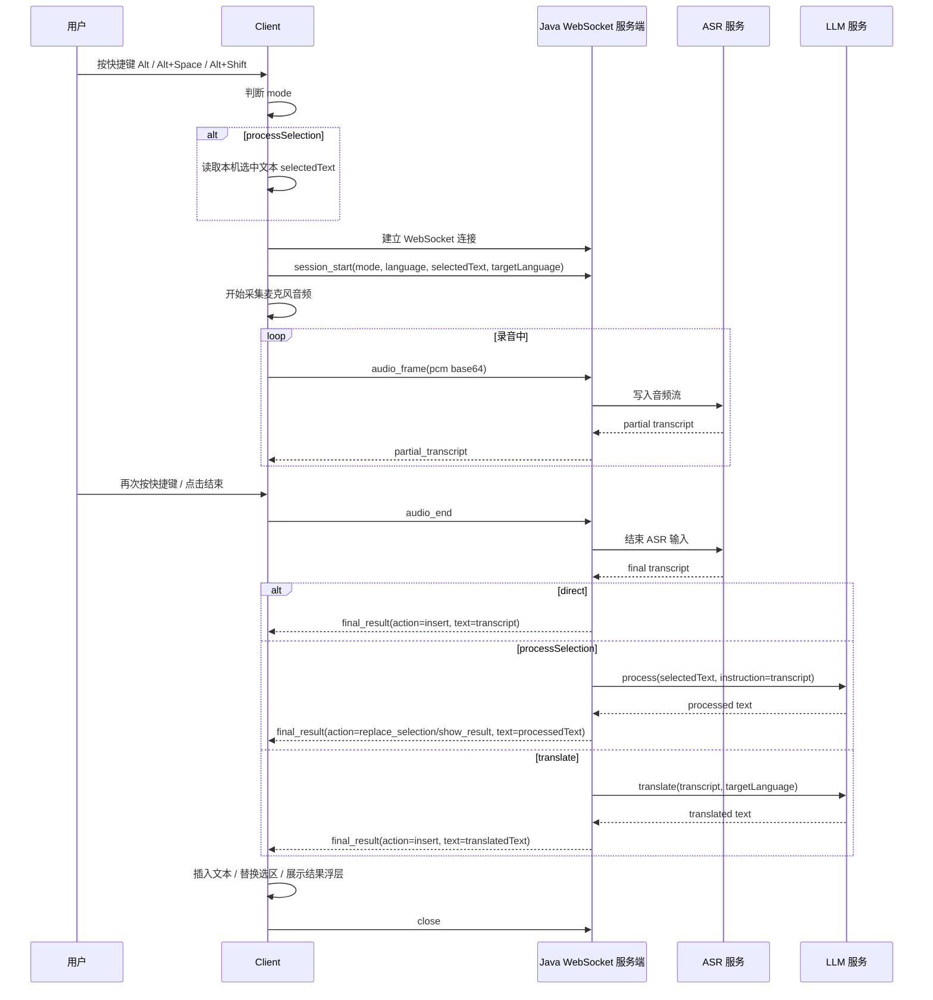

# Java Voice WebSocket Protocol

本文档描述正式上线后客户端与 Java 服务端之间的语音 WebSocket 协议。客户端只负责快捷键、采音、发送音频、接收结果并执行插入/替换/展示；Java 服务端负责 ASR、LLM 后处理以及三种语音模式的业务分支。

## 设计原则

- 按下语音快捷键时创建一次 WebSocket 语音会话，会话结束后关闭连接。
- `mode` 在 `session_start` 中声明，不放在每个音频帧里。
- 音频帧只传音频数据，ASR 不关心三种业务模式。
- Java 服务端在拿到 ASR final transcript 后，根据 `mode` 决定是否调用 LLM。
- `processSelection` 的本机选中文本必须由客户端在会话开始前读取，并随 `session_start` 发送给服务端。

## 模式定义

| mode | 名称 | 客户端前置动作 | Java 服务端动作 | 客户端结果动作 |
| --- | --- | --- | --- | --- |
| `direct` | 语音直写 | 无 | ASR 得到 transcript 后直接返回 | 插入到光标处 |
| `processSelection` | 选区 + 语音指令 | 读取本机选中文本 `selectedText` | ASR 得到语音指令后调用 LLM 处理选区 | 替换选区或展示结果浮层 |
| `translate` | 语音翻译 | 无 | ASR 得到 transcript 后调用 LLM 翻译 | 插入到光标处 |

## 时序图



## Client -> Server

### 1. `session_start`

客户端建立 WebSocket 后必须先发送 `session_start`。服务端收到后创建语音会话，并记录本次会话的模式和上下文。

#### direct

```json
{
  "type": "session_start",
  "sessionId": "voice-20260605-001",
  "mode": "direct",
  "language": "mandarin",
  "sampleRate": 16000,
  "audioFormat": "pcm16",
  "targetLanguage": "en-US"
}
```

说明：

- `direct` 不需要 `selectedText`。
- `targetLanguage` 可保留为统一字段，但服务端在 `direct` 模式下不使用。

#### processSelection

```json
{
  "type": "session_start",
  "sessionId": "voice-20260605-002",
  "mode": "processSelection",
  "language": "mandarin",
  "sampleRate": 16000,
  "audioFormat": "pcm16",
  "selectedText": "这是一段需要被润色的原始文本。",
  "postprocessMode": "clean",
  "targetLanguage": "en-US",
  "appContext": {
    "appName": "Word",
    "windowTitle": "Document"
  }
}
```

说明：

- `selectedText` 由客户端从当前活动窗口读取。
- ASR final transcript 在该模式下表示用户的语音指令，例如“帮我润色得更正式一点”。
- Java 服务端应将 `selectedText` 与 ASR transcript 一起交给 LLM。
- `postprocessMode` 可用于表达改写、总结、列表化等后处理意图；如果暂时只有默认处理，可以固定为 `clean`。

#### translate

```json
{
  "type": "session_start",
  "sessionId": "voice-20260605-003",
  "mode": "translate",
  "language": "mandarin",
  "sampleRate": 16000,
  "audioFormat": "pcm16",
  "targetLanguage": "en-US"
}
```

说明：

- ASR final transcript 在该模式下表示待翻译原文。
- Java 服务端根据 `targetLanguage` 调用 LLM 翻译。

### 2. `audio_frame`

录音过程中客户端持续发送音频帧。

```json
{
  "type": "audio_frame",
  "sessionId": "voice-20260605-001",
  "seq": 1,
  "pcm": "AAECAwQFBgcICQoLDA0ODxAREhMUFRYXGBkaGxwdHh8="
}
```

字段说明：

| 字段 | 类型 | 必填 | 说明 |
| --- | --- | --- | --- |
| `type` | string | 是 | 固定为 `audio_frame` |
| `sessionId` | string | 是 | 本次语音会话 ID |
| `seq` | number | 是 | 音频帧序号，从 1 递增 |
| `pcm` | string | 是 | PCM16 单声道小端音频的 Base64 |

### 3. `audio_end`

用户结束录音时客户端发送。

```json
{
  "type": "audio_end",
  "sessionId": "voice-20260605-001"
}
```

服务端收到后应停止接收音频，等待 ASR final transcript，再进入 mode 分支处理。

### 4. `cancel`

用户取消录音或处理时客户端发送。服务端应释放 ASR/LLM 资源，并终止会话。

```json
{
  "type": "cancel",
  "sessionId": "voice-20260605-001",
  "reason": "user_cancelled"
}
```

## Server -> Client

### 1. `session_started`

服务端确认会话已创建。

```json
{
  "type": "session_started",
  "sessionId": "voice-20260605-001"
}
```

### 2. `partial_transcript`

ASR 中间结果。客户端可用于实时字幕或状态展示。

```json
{
  "type": "partial_transcript",
  "sessionId": "voice-20260605-001",
  "text": "今天下午"
}
```

### 3. `final_result`

服务端完成 ASR 以及必要的 LLM 处理后返回最终结果。

#### direct

```json
{
  "type": "final_result",
  "sessionId": "voice-20260605-001",
  "mode": "direct",
  "transcript": "今天下午三点开会",
  "action": "insert",
  "text": "今天下午三点开会"
}
```

处理规则：

- Java 服务端不调用 LLM。
- `text` 等于 ASR final transcript。
- 客户端执行插入。

#### processSelection

```json
{
  "type": "final_result",
  "sessionId": "voice-20260605-002",
  "mode": "processSelection",
  "transcript": "帮我润色得更正式一点",
  "action": "replace_selection",
  "text": "这是一段经过正式润色后的文本。",
  "warnings": []
}
```

处理规则：

- `transcript` 是用户语音指令。
- `text` 是 LLM 处理后的结果。
- `action` 可为：
  - `replace_selection`：客户端替换原选区。
  - `show_result`：客户端展示结果浮层，由用户复制或确认。

#### translate

```json
{
  "type": "final_result",
  "sessionId": "voice-20260605-003",
  "mode": "translate",
  "transcript": "请明天下午三点参加会议",
  "action": "insert",
  "text": "Please attend the meeting at 3 PM tomorrow.",
  "warnings": []
}
```

处理规则：

- `transcript` 是 ASR 识别出的原文。
- `text` 是 LLM 翻译后的结果。
- 客户端执行插入。

### 4. `error`

服务端异常返回。

```json
{
  "type": "error",
  "sessionId": "voice-20260605-001",
  "code": "ASR_TIMEOUT",
  "message": "ASR final result timed out"
}
```

建议错误码：

| code | 说明 |
| --- | --- |
| `INVALID_SESSION` | 会话不存在或已结束 |
| `INVALID_MESSAGE` | 消息体格式错误 |
| `ASR_CONNECT_FAILED` | ASR 服务连接失败 |
| `ASR_TIMEOUT` | ASR final 超时 |
| `LLM_TIMEOUT` | LLM 请求超时 |
| `LLM_FAILED` | LLM 请求失败 |
| `SERVER_ERROR` | 服务端内部错误 |

## 推荐字段约束

| 字段 | 建议 |
| --- | --- |
| `sessionId` | 客户端生成 UUID 或服务端在 `session_started` 返回均可；建议客户端生成，便于日志串联 |
| `sampleRate` | 固定 `16000` |
| `audioFormat` | 固定 `pcm16` |
| `pcm` | Base64 编码的 PCM16 单声道小端数据 |
| `seq` | 从 1 递增，用于排查丢帧和乱序 |
| `mode` | 只允许 `direct`、`processSelection`、`translate` |
| `action` | 只允许 `insert`、`replace_selection`、`show_result` |

## Java 服务端分支伪代码

```text
on session_start:
  save session metadata: mode, language, selectedText, targetLanguage

on audio_frame:
  append pcm to ASR stream

on audio_end:
  transcript = finish ASR stream

  if transcript is empty:
    send final_result(action=insert, text="", transcript="")
    close session

  if mode == direct:
    send final_result(action=insert, text=transcript, transcript=transcript)

  if mode == processSelection:
    processedText = LLM.process(selectedText, instruction=transcript, postprocessMode)
    send final_result(action=replace_selection or show_result, text=processedText, transcript=transcript)

  if mode == translate:
    translatedText = LLM.translate(transcript, targetLanguage)
    send final_result(action=insert, text=translatedText, transcript=transcript)
```
